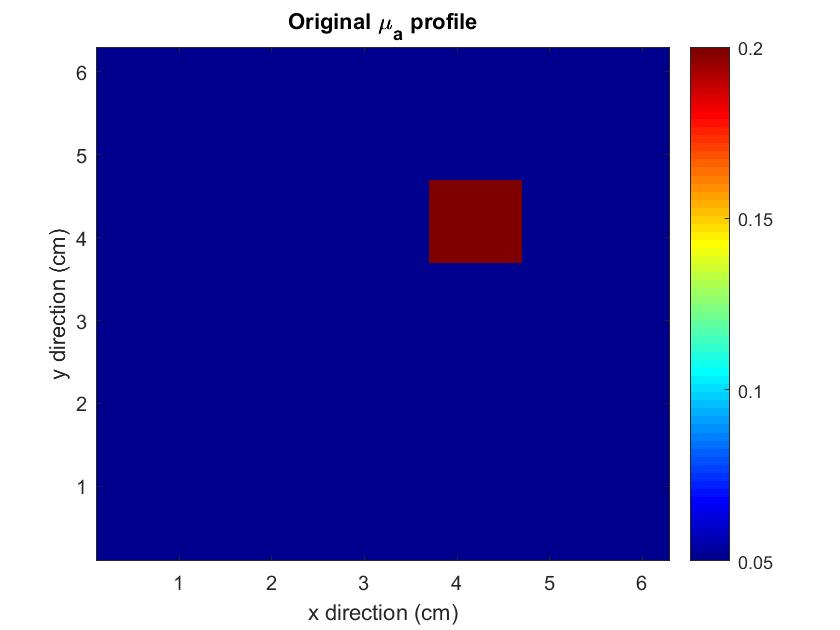
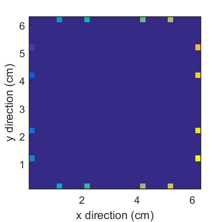

# Steepest-Descent-Method-and-DOT-Imaging

Diffuse Optical Tomography (DOT) is an non-invasive optical imaging technique that measures the optical properties of physiological tissue using light in the near infrared spectrum. Optical properties are extracted from the measurement using reconstruction algorithm.

This project synthesizes measurement data by solving the 2-dimensional finite volume forward model with a set of known optical properties. This projects examines one of the reconstruction algorithms - the steepest descent method in combination with inexact line search - in the task of reconstructing the absorption profile.

# The Original Optical Properties

The original $\mu_a$ profile:

# The location of detectors are shown as the colored dots on the boundaries

# Reconstructed Optical Properties

The $\mu_a$ profile (left) and the gradient (right) at the 100th iteration. Color bar of $\mu_a$ is in the unit of $cm^{-1}$:

The $\mu_a$ profile (left) and the gradient (right) at the 500th iteration:

The $\mu_a$ profile (left) and the gradient (right) at the 1000th iteration.

The $\mu_a$ profile (left) and the gradient (right) at the 5000th iteration:

The $\mu_a$ profile (left) and the gradient (right) at the 10000th iteration:

The $\mu_a$ profile (left) and the gradient (right) at the 35000th iteration:

