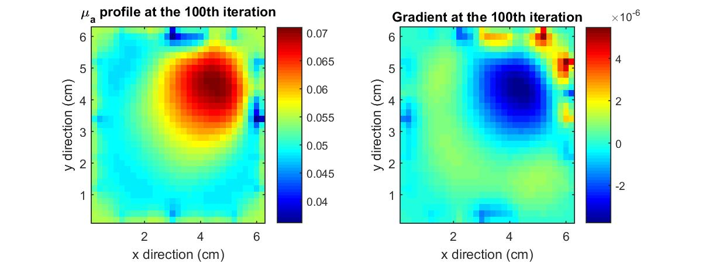
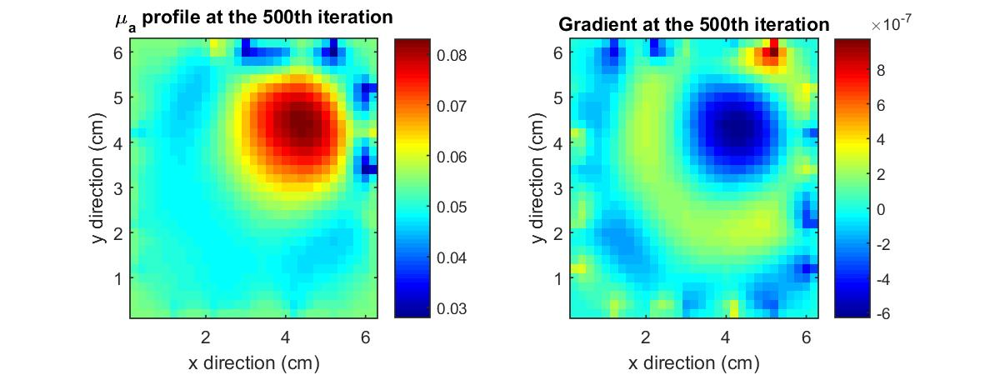
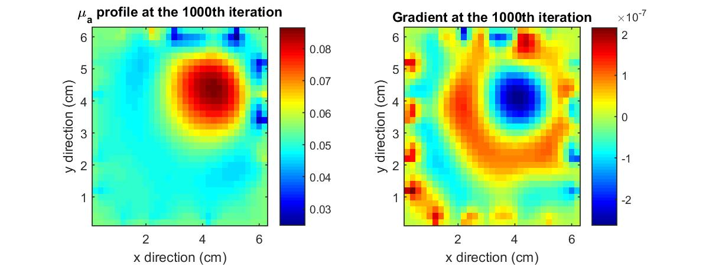
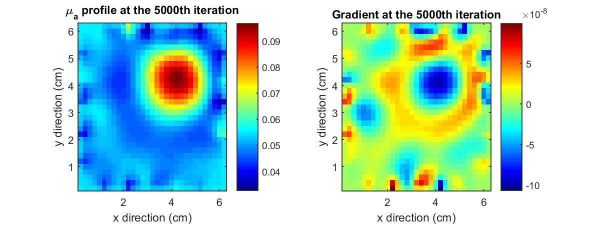
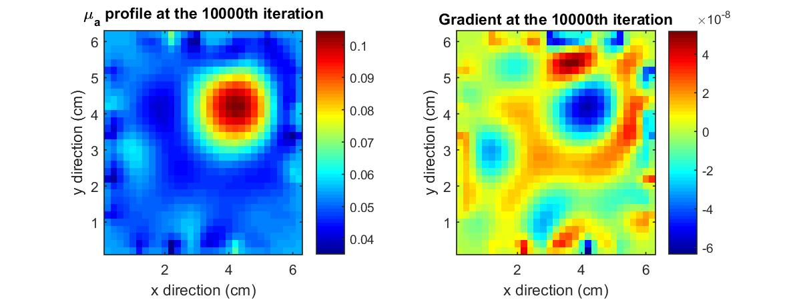
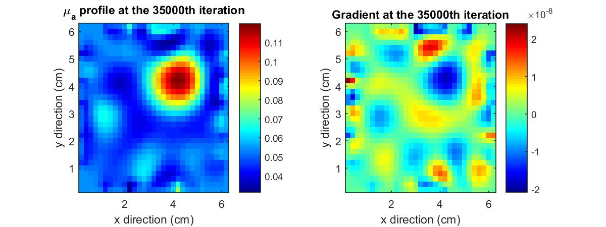

# Steepest-Descent-Method-and-DOT-Imaging

Diffuse Optical Tomography (DOT) is an non-invasive optical imaging technique that measures the optical properties of physiological tissue using light in the near infrared spectrum. Optical properties are extracted from the measurement using reconstruction algorithm.

This project synthesizes measurement data by solving the 2-dimensional finite volume forward model with a set of known optical properties. This projects examines one of the reconstruction algorithms - the steepest descent method in combination with inexact line search - in the task of reconstructing the absorption profile.

The $\mu_a$ profile (left) and the gradient (right) at the 100th iteration. Color bar of $\mu_a$ is in the unit of $cm^{-1}$.

The $\mu_a$ profile (left) and the gradient (right) at the 500th iteration.

The $\mu_a$ profile (left) and the gradient (right) at the 1000th iteration.

The $\mu_a$ profile (left) and the gradient (right) at the 5000th iteration.

The $\mu_a$ profile (left) and the gradient (right) at the 10000th iteration.

The $\mu_a$ profile (left) and the gradient (right) at the 35000th iteration.

\section{Introduction}

% How is your project related to optical imaging?
% Why is this topic important to the field of optical imaging?
% How can these methods potentially be used in a clinical setting?

DOT is an important tool in in vivo optical imaging because it can provide quantitative information about light absorption/scattering, hemoglobin concentration and blood oxygenation. The technique is based on diffuse light that penetrates tissue at multiple source projections to create spatial maps of optical properties. Light fibers are used as laser source and detectors which are arranged in arrays around the object. 

The technique requires the object of interest being partially or fully light-transmitting or translucent. Therefore, DOT works the best on soft tissues such as breast and brain tissue. Some of its applications include breast cancer imaging and monitoring the effect of cancer treatments, as well as measuring changes in blood oxygenation caused by neural activity. 

Based on the detector measurements, tomographic images and spatial maps of tissue's optical properties such as light absorption/scattering and diffusion coefficient can be obtained using model-based reconstruction algorithms. 

This project synthesizes measurement data by solving the 2-dimensional finite volume forward model with a set of known optical properties. This projects examines one of the reconstruction algorithms -- the steepest descent method in combination with inexact line search -- in the task of reconstructing the absorption profile. 

%--------------############################-----------------
\section{Methods}

% Describe in detail what you did.
% Include necessary equations and diagrams to explain your method.
% Include the original and discretized equations you used. Do not include derivations!

\subsection{Setup}
The object/medium of interest is a 6cm-by-6cm 2D square. Inside, there is a small square centered at position (4cm, 4cm) of size 1cm-by-1cm. The optical properties are $\mu_a = 0.05 cm^{-1}$ and $\mu_s = 100 cm^{-1}$ for the background medium and $\mu_a = 0.2 cm^{-1}$ and $\mu_s = 100 cm^{-1}$ for the object. The anisotropic factor is constant over the entire medium, given by $g = 0.95$, and the refractive indices are $n_{medium}=1.414$ and $n_{air}=1$. 

Following the setup, the orignial $\mu_a$ profile is shown in Figure \ref{fig:original_mua}.
\begin{figure}[!hbt]
  \centering
  \includegraphics[width=0.6\linewidth]{original_mua.jpg}
  \caption{The original $\mu_a$ profile.}
  \label{fig:original_mua}
\end{figure}
In this project, the following assumptions were made so there was only 1 unknown optical property -- absorption coefficient $\mu_a$ -- needed be extracted
\begin{enumerate}
	\item the diffusion coefficient $D$ is 1/15 cm and it is constant over the medium;
    \item the scattering coefficient $\mu_s$ is constant over the medium.
\end{enumerate}

\subsection{Generating the Synthetic Measurements}
The first step in generating the measurement data was to obtain the finite volume solutions of the 2D time-independent diffusion equation. This step is referred to as solving the forward model. The 2D time-independent diffusion equation is
\begin{align}
	D\frac{\partial^2 U}{\partial x^2}+D\frac{\partial^2 U}{\partial y^2}-\mu_aU+S=0
\end{align}
where $D$ is the diffusion coefficient, $U$ is the fluence and $S$ represents the source. Below shows the discretized equations of the 2D diffusion equation 
\begin{align*}
	\begin{cases}
        \textrm{internal: } a_{P_I}U_P-\alpha U_W-\alpha U_E-\alpha U_S-\alpha U_N=0\\
	    \textrm{west (source): } a_{P_{W_0}}U_P-\alpha U_E-\beta U_S-\beta U_N=b\\
        \textrm{west: } a_{P_W}U_P-\alpha U_E-\beta U_S-\beta U_N=0\\
        \textrm{east: } a_{P_E}U_P-\alpha U_W-\beta U_S-\beta U_N=0\\
        \textrm{north: } a_{P_N}U_P-\beta U_W-\beta U_E-\alpha U_S=0\\
        \textrm{south: } a_{P_S}U_P-\beta U_W-\beta U_E-\alpha U_N=0\\
        \textrm{NW: } a_{P_{NW}}U_P-\beta U_E-\beta U_S=0\\
        \textrm{NE: } a_{P_{NE}}U_P-\beta U_W-\beta U_S=0\\
        \textrm{SW: } a_{P_{SW}}U_P-\beta U_E-\beta U_N=0\\
        \textrm{SE: } a_{P_{SE}}U_P-\beta U_W-\beta U_N=0
	\end{cases}
\end{align*}
where 
\begin{align*}
    &b =\frac{\Delta y}{2A}\\
	&\alpha=D\\
    &\beta=\frac{D}{2}\\
    &a_{P_I} =4D+\mu_a\Delta x\Delta y\\
    &a_{P_{W}}=a_{P_{W_0}}=a_{P_{E}}=a_{P_{N}}=a_{P_{S}}=2D+b+\mu_a\frac{\Delta x\Delta y}{2}\\
    &a_{P_{NW}}=a_{P_{NE}}=a_{P_{SW}}=a_{P_{SE}}=D+\frac{\Delta x+\Delta y}{4A}+\mu_a\frac{\Delta x\Delta y}{4}
\end{align*}
The discretization equations can be written into a matrix vector equation
\begin{align}
	\boldsymbol{A}\boldsymbol{U}=\boldsymbol{b}.
\end{align}
Let $N$ be the number of nodes in the $x$ or $y$ direction, then $\boldsymbol{M}$ is a size $N^2$-by-$N^2$ matrix
\setcounter{MaxMatrixCols}{15}
\begin{equation}
    \scalemath{.9}{
        \begin{bmatrix}
            a_{P_{NW}} & -\beta & 0 & \cdots & 0 & -\beta & 0 & \cdots & & & & & & \cdots & 0\\
            -\beta & a_{P_N} & -\beta & 0 & \cdots & 0 & -\alpha & 0 & \cdots & & & & & \cdots & 0\\
            0 & \ddots & \ddots & \ddots & 0 & \cdots & 0 & \ddots & 0 & \cdots & & & & \cdots & 0\\
            0 & 0 & -\beta & a_{P_N} & -\beta & 0 & \cdots & 0 & -\alpha & 0 & \cdots & & & \cdots & 0\\
            0 & \cdots & 0 & -\beta & a_{P_{NE}} & 0 & 0 & \cdots & 0 & -\beta & 0 & \cdots & & \cdots & 0\\
            -\beta & 0 & \cdots & 0 & 0 & a_{P_W} & -\alpha & 0 & \cdots & 0 & -\beta & 0 & \cdots & \cdots & 0\\
            0 & -\alpha & 0 & \cdots & 0 & -\alpha & a_{P_I} & -\alpha & 0 & \cdots & 0 & -\alpha & 0 & \cdots & 0\\
            0 & 0 & \ddots & 0 & \cdots & 0 & \ddots & \ddots & \ddots & 0 & \cdots & 0 & \ddots & 0 & 0\\
            0 & \cdots & 0 & -\alpha & 0 & \cdots & 0 & -\alpha & a_{P_I} & -\alpha & 0 & \cdots & 0 & -\alpha & 0\\
            0 & \cdots & \cdots & 0 & -\beta & 0 & \cdots & 0 & -\alpha & a_{P_{E}} & 0 & 0 & \cdots & 0 & -\beta \\
            0 & \cdots & & \cdots & 0 & -\beta & 0 & \cdots & 0 & 0 & a_{P_{SW}} & -\beta & 0 & \cdots & 0\\
            0 & \cdots & & & \cdots & 0 & -\alpha & 0 & \cdots & 0 & -\beta & a_{P_S} & -\beta & 0 & 0\\
            0 & \cdots & & & & \cdots & 0 & \ddots & 0 & \cdots & 0 & \ddots & \ddots & \ddots & 0\\
            0 & \cdots & & & & & \cdots & 0 & -\alpha & 0 & \cdots & 0 & -\beta & a_{P_S} & -\beta\\
            0 & \cdots & & & & & & \cdots & 0 & -\beta & 0 & \cdots & 0 & -\beta & a_{P_{SE}}
        \end{bmatrix}
    }
\end{equation}
where the middle 5 rows are repeated $m-2$ times. $\boldsymbol{b}$ is a $N^2$-by-1 matrix with the entry at the center row (ie. $\frac{N^2}{2}$th row)
\begin{align}
    \scalemath{1.0}{
        \boldsymbol{b}=
        \begin{bmatrix}
            0\\
            \vdots\\
            0\\
            b\\
            0\\
            \vdots\\
            0\\
        \end{bmatrix}
    }
\end{align}

Therefore, the fluence $\boldsymbol{U}$ is simply $\boldsymbol{A}^{-1}\boldsymbol{b}$. The measurements of the partial currents at the 16 detector locations is given by $\boldsymbol{Q}\boldsymbol{U}$, where $\boldsymbol{Q}$ is the measurement operator hat encodes the location of the detectors. $\boldsymbol{Q}$ takes on the value $\frac{1}{2}\left(\frac{1-R_{eff}}{1+R_{eff}}\right)$ at detector location and zero otherwise. See Figure \ref{fig:detector_loc} for the location of detectors. Given that there were 4 sources and 16 detectors located at the boundaries, 64 measurements were generated in total. See Table \ref{table:meas} in Appendix A for the synthetic measurements.
\begin{figure}[H]
  \centering
  \includegraphics[width=0.4\linewidth]{detector_loc.jpg}
  \caption{The detectors are shown as the colored dots on the boundaries.}
  \label{fig:detector_loc}
\end{figure}

\subsection{Solving the Inverse Model}
The synthetic measurements were used to derived the $\mu_a$ profile. This step is referred to as solving the inverse model. In this project, the steepest descent method along with evolution strategy and inexact line search were used. The goal of solving the inverse model is to minimize the objective function $f$. This entails
\begin{enumerate}
  \item solving forward problem for $\boldsymbol{U}$ with an estimated $x$ (where $x=\mu_a$ in this case); 
  \item evaluation of $f$ using $\boldsymbol{U}$; 
  \item repeat the steps 1-2 with the new $x$ until minimum of $f$ is found.
\end{enumerate}

\subsection{Steepest Descent Method with Inexact Line Search}
The basic idea behind the iteration process is to generate a sequence of updates $x(k)$ that can decrease $f(x)$ towards the minimum $f(x^*)$ as 
\begin{align}
	x^{k+1}=x^k+\Delta x^k
\end{align}
such that
\begin{align}
	f(x^k+\Delta x^k)<f(x^k).
\end{align}
The steepest descent method is a gradient-type method that finds $\Delta x$ using the first derivative of $f(x)$. The negative gradient of the objective function (i.e. the descent direction) is $\Delta x$
\begin{align}
	\Delta x^k = - \nabla f(x^k).
\end{align}
The algorithm would stop once it satisfies the stopping criterion, which usually takes the form
\begin{align}
	||\nabla f(x^k)||_2<\epsilon.
\end{align}
Sometimes, there is no need to take the full $\Delta x$ step; and inexact line search finds the step size $t_{new}=0.5t$ that minimize the objective function using the following condition
\begin{align}
	f(x^k+t^k\Delta x^k) < f(x^k)+\alpha t_{new} \nabla f(x)^T \Delta x \textrm{\,\,\,\,\,\,\, with } \alpha=10^{-4}.
\end{align}
In this project, a initial step size of 20 ($t=20$) was used to speed up the algorithm. 

In summary, the reconstruction algorithm contains the following steps
\begin{center}
    \begin{alltt}
        \textbf{given} a starting point x,
        \textbf{repeat}
        1. Determine a descent direction \(\Delta\)x = -\(\nabla\)f(x).
        2. Line search. Choose a step size t > 0.
        3. Update x := x + t\(\Delta\)x.
        4. Evaluate f(x)
        \textbf{until} stopping criterion is satisfied.
    \end{alltt}
\end{center}
See Listing \ref{lst:evolution_stategy} for the evolution strategy MATLAB code, Listing for the solving forward model function, Listing for the solving inverse model function and Listing for the code that runs the forward and inverse model.

\subsection{Evolution Strategy}
Evolution strategy finds the optimal initial guess of $\mu_a$ by sampling across a range of $\mu_a$ values. The steps are as follow
\begin{enumerate}
    \item Initialization: randomly choosing $N_p$ number of parents $\mu_a$ values ($p^1, p^2, p^3,\cdots p^{N_p}$) in the range between 0.01 $cm^{-1}$ and 2 $cm^{-1}$.
    \item Generation of offspring: for each pair of parents, one child is created in a two-step process: recombination and mutation. This project following a simple recombination rule by averaging optical properties of each parent 
        \begin{align}
            p^{com(i,j)}=\frac{1}{2}(p^i+p^j) \textrm{\,\,\,\,\,\,\, with pair} (i,j).
        \end{align}
	In the mutation step, the averaged optical properties are further modified as follows
        \begin{align}
            c^{com(i,j)}=p^{com(i,j)}+\sigma \omega
        \end{align}
	where $\omega$ is the Gaussian distributed random number, and $\sigma$ is the standard deviation that is set to be $\sigma=\frac{1}{3}p_{old}$.
    \item Selection: once the offspring are generated, the objective function of each children are evaluated and $N_p$ members with the lowest objective function values are selected as the new parent generation.
    \item Repeat steps 1-3 until the objective function converges.
\end{enumerate}

\subsection{Objective Function and Gradient}
The objective function is the summation of the different between the measurements $\boldsymbol{P}$ and the predictions $\boldsymbol{M}$ given $x$ (i.e. $\mu_a$ profile)
\begin{align}
	f(s)=\frac{1}{2}\sum_{s=1}^{N_s}\sum_{d=1}^{N_d} (\boldsymbol{P}_{s,d}(\boldsymbol{U})-\boldsymbol{M}_{s,d})^T(\boldsymbol{P}_{s,d}(\boldsymbol{U})-\boldsymbol{M}_{s,d}).
\end{align}
To speed up the code, a slightly different objective function was used
\begin{align}
	f(s)=\frac{1}{2}\sum_{s=1}^{N_s}\sum_{d=1}^{N_d} (P_{s,d}(\boldsymbol{U})/M_{s,d}-1)^T(P_{s,d}(\boldsymbol{U})/M_{s,d}-1).
\end{align}
The gradient is calculated using the adjoint equation
\begin{align}
	\nabla f = - \sum_{s=1}^{N_s} \frac{\partial(\boldsymbol{A}\boldsymbol{U}_s)^T}{\partial x}\eta_s
\end{align}
where
\begin{align}
	\eta = \boldsymbol{A}^{-T}\boldsymbol{Q}^T(\boldsymbol{P}-\boldsymbol{M}).
\end{align}
Given that the objective function was modifies, $\eta$ would need to change as well
\begin{align}
	\eta = \boldsymbol{A}^{-T}\boldsymbol{Q}^T(\boldsymbol{P}/\boldsymbol{M}-1).
\end{align}

See Listing \ref{lst:evolution_stategy} for the evolution strategy MATLAB code, Listing for the solving forward model function, Listing for the solving inverse model function and Listing for the code that runs the forward and inverse model.
